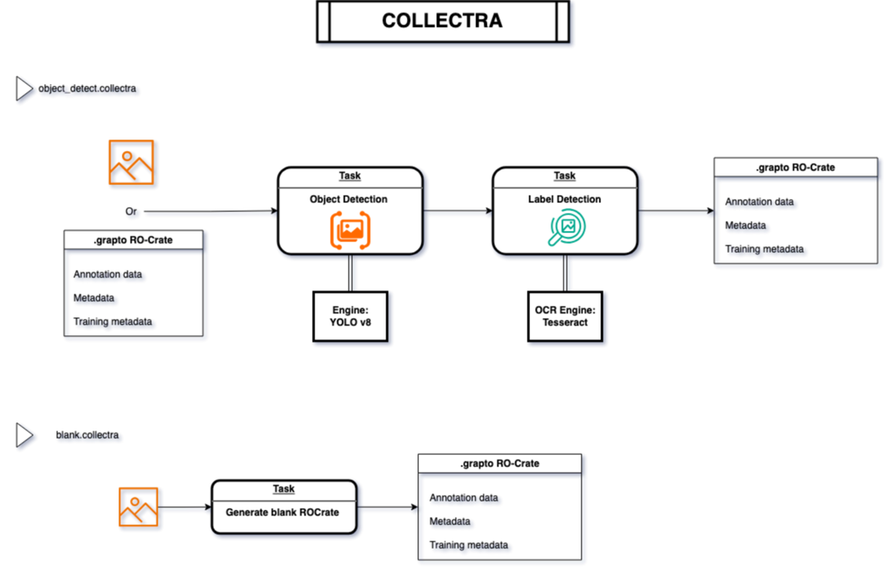

.. image:: https://curly-adventure-5j8lz2j.pages.github.io/_images/collectra-banner.png

.. start-badges

|testing badge| |coverage badge| |docs badge| |black badge| |torchapp badge|

.. |testing badge| image:: https://github.com/unimelbmdap/collectra/actions/workflows/testing.yml/badge.svg
    :target: https://github.com/unimelbmdap/collectra/actions

.. |docs badge| image:: https://github.com/unimelbmdap/collectra/actions/workflows/docs.yml/badge.svg
    :target: https://unimelbmdap.github.io/collectra
    
.. |black badge| image:: https://img.shields.io/badge/code%20style-black-000000.svg
    :target: https://github.com/psf/black
    
.. |coverage badge| image:: https://img.shields.io/endpoint?url=https://gist.githubusercontent.com/unimelbmdap/f1d9191993105301fd6f813fe1e659f6/raw/coverage-badge.json
    :target: https://unimelbmdap.github.io/collectra/coverage/

.. |torchapp badge| image:: https://img.shields.io/badge/torch-app-B1230A.svg
    :target: https://rbturnbull.github.io/torchapp/
    
.. end-badges

.. start-quickstart

Builds pipelines to extract data from collection images.

Installation
==================================

Install using pip:

.. code-block:: bash

    pip install git+https://github.com/unimelbmdap/collectra.git

.. end-quickstart

System Design
==================================

Collectra fulfills the following user stories:
***********************************************

1. Basic File Processing
    - Upload a specified photo or a collection of photos from a folder. 
        - If the photo/photos do not have an acommpanying annotation file, it will generate a blank grapto file.        
    - Upload a single or a list of ``.grapto`` files.

2. Workflow Management
    - Select pre-built task templates and chain them together to create a workflow.
    - Have each workflow run saved as a ``.grapto`` file.    
    - Have both the workflow chain and the list of ``.grapto`` files saved in a ``.collectra`` file.
    - Save the best training model information in the ``.collectra`` file.

3. Task & Engine Management
    - Select a new task template from a list of available tasks and choose an engine to run the task.
    - Run a detection workflow with a fined-tuned model as specified by the ``.collectra`` file. 

Architecture
*************
Each project is saved as a ``.collectra`` file, describing the the workflow which includes:

- A task: how to process a particular file
- An engine: what is used to process the file

When a raw file is processed by the task, the output is saved as a ``.grapto`` file.

Both ``.collectra`` and ``.grapto`` files conform to the `RO-Crate 1.1 specification <https://www.researchobject.org/ro-crate/specification/1.2/>`_

A ``.collectra`` file contains the following data:
- Definitions of the task and associated engine. 
- If the engine is a trained model, the location of the model is also specified. 

Input:
- A list of files to be processed, which can be either raw images or existing ``.grapto`` files.

Output:
- A list of ``.grapto`` files, which are the processed outputs of the input files.

Usage:
=======

.. code-block:: bash

    collectra train --workflow grapto.collectra --engine yolo_primary_label --training train --validation valid

 
Credits
==================================

.. start-credits

Robert Turnbull

For more information contact: <robert.turnbull@unimelb.edu.au>

James Quang

For more information contact: <james.quang@unimelb.edu.au>

Created using `torchapp <https://github.com/rbturnbull/torchapp>`_.

.. end-credits

